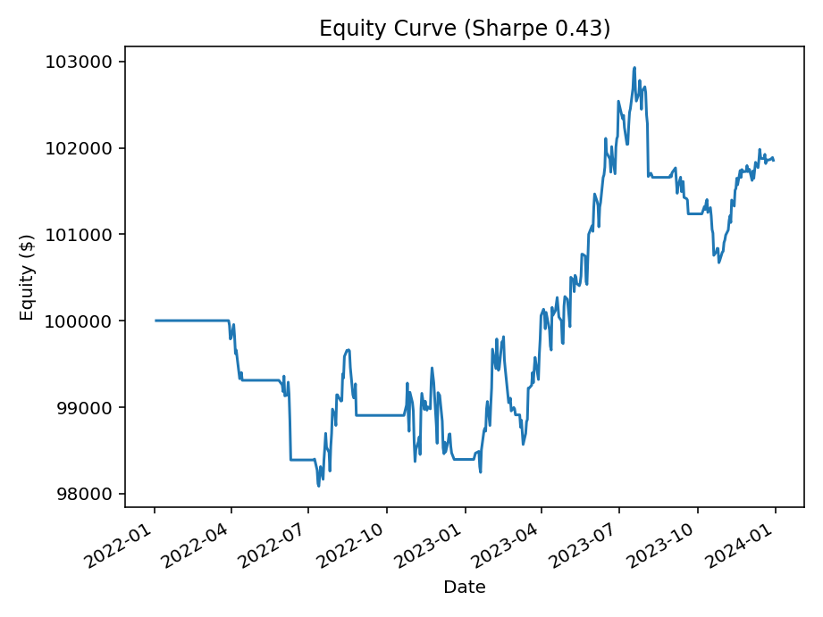

# 🦙 Alpaca Live SMA+BB Trader (Minimal, Multi-Symbol)

A practical **live/paper trading bot** for Alpaca that uses **SMA(20/50) crossovers** with a **Bollinger Bands (20, 1σ)** breakout fallback.  
Designed to be **reliable and transparent** for real orders, with a built-in **lightweight backtester** that saves PnL CSV/PNG and reports **Sharpe**.

---

## 🚀 Features

- **Live trading via Alpaca REST**
- **Signals**: SMA(20/50) crossover → fallback to Bollinger(20, 1σ) breakout
- **Multi-symbol** (e.g., `SPY`, `AAPL`, `MSFT`)
- **Simple risk sizing**: cash-at-risk %, split across active signals, per-symbol cap
- **Safety guards**: no naked shorts by default; optional “close on opposite” behavior
- **Backtester**: daily loop, equity curve PNG, returns CSV, **Sharpe ratio**

---

## 📊 Example Output


\[ AAPL ]
SMA fast\[20] last=201.8973 prev=202.6453 | slow\[50] last=201.4053 prev=201.9539 | close=196.3700
BB(period=20, n=1.0) | close=196.3700, mid=201.8973, upper=205.6656, lower=198.1289
signal=BB breakout ↓
\[AAPL] → SELL via BB
\[ MSFT ]
SMA fast\[20] last=463.1220 prev=462.0200 | slow\[50] last=425.6564 prev=423.7984 | close=474.8800
BB(period=20, n=1.0) | close=474.8800, mid=463.1220, upper=471.1893, lower=455.0547
signal=BB breakout ↑
\[MSFT] → BUY via BB
\[AAPL] Sell signal but no long position; skipping to avoid naked short.
\[MSFT] BUY 10 @ \~474.88  (order\_id=xxxxxxxx-xxxx-xxxx-xxxx-xxxxxxxxxxxx)


---

## ⚙️ How It Works

1. **Data Fetch**
   - Uses **Alpaca Market Data v2** (IEX by default) for daily bars.
   - Separate hosts for **trading** and **market data**.

2. **Signal Generation**
   - **SMA crossover**: fast(20) over slow(50) → **BUY**; under → **SELL**.
   - If no cross, check **Bollinger(20, 1σ)**: close > upper → **BUY**; close < lower → **SELL**.
   - Priority: **SMA first, then BB** fallback (can be swapped).

3. **Sizing & Execution**
   - Cash-at-risk % of **available cash** × split across active signals.
   - Per-symbol allocation capped by a fraction of available cash.
   - Integer shares only; gentle pacing between orders.

4. **Backtesting**
   - Daily loop using local `*_ohlcv.csv` files or Alpaca data.
   - Tracks **cash, positions, equity**, computes daily returns and **Sharpe**.
   - Saves `backtest_equity.csv` + **equity curve PNG**.

---

## 📦 Installation

```bash
# Create a virtual env (recommended)
python3 -m venv .venv
source .venv/bin/activate

# Install dependencies
pip install requests pandas pyyaml matplotlib
````

---

## 🖥️ Usage

### Live Trading (paper by default)

Places orders; prints signals (no chart):

```bash
/usr/local/bin/python3 /path/to/alpaca-live-sma-bb-trader/simplified_tradingbot.py
```

### Backtest (chart + CSV + Sharpe)

Runs the backtester; writes files next to the script:

```bash
RUN_BACKTEST=1 /usr/local/bin/python3 /path/to/alpaca-live-sma-bb-trader/simplified_tradingbot.py
```

Outputs:

* `backtest_equity.csv` (date, equity, ret)
* `backtest_equity.png` (equity curve; Sharpe in title)
* Console: **Final Equity** and **Sharpe**

> Headless/IDE sessions:
> `export MPLBACKEND=Agg` then open the PNG file.

---

## 🔑 Credentials & Endpoints

Export environment variables (preferred):

```bash
export APCA_API_KEY_ID="YOUR_KEY_ID"
export APCA_API_SECRET_KEY="YOUR_SECRET"
export APCA_API_BASE_URL="https://paper-api.alpaca.markets/v2"   # trading
export APCA_DATA_BASE_URL="https://data.alpaca.markets/v2"       # market data
export APCA_DATA_FEED="iex"                                      # free tier
```

Or use `config.yml` (the code falls back to this if env vars are absent):

```yaml
alpaca:
  API_KEY: "YOUR_KEY_ID"
  API_SECRET: "YOUR_SECRET"
  BASE_URL: "https://paper-api.alpaca.markets/v2"
  DATA_BASE_URL: "https://data.alpaca.markets/v2"

Symbols:
  - SPY
  - AAPL
  - MSFT

CashAtRisk: 0.10
PerSymbolCap: 0.50
LookbackBars: 200

StartDate: "2024-01-01"
EndDate: null
InitialCash: 100000
RiskFreeAnnual: 0.00
CommissionPerShare: 0.00
BacktestCSV: "backtest_equity.csv"
Plot: true

AllowShorts: false
CloseOnOpposite: true
```

---

## ⚙️ Optional Settings

**Env Vars** (short descriptions only):

| Var                   | Purpose                 |
| --------------------- | ----------------------- |
| `APCA_API_KEY_ID`     | Alpaca key ID           |
| `APCA_API_SECRET_KEY` | Alpaca secret           |
| `APCA_API_BASE_URL`   | Trading API host        |
| `APCA_DATA_BASE_URL`  | Market data host        |
| `APCA_DATA_FEED`      | Data feed (e.g., `iex`) |
| `RUN_BACKTEST`        | `1` to backtest         |

**Config Keys** (short descriptions only):

| Key                   | Purpose           |
| --------------------- | ----------------- |
| `Symbols`             | Ticker list       |
| `CashAtRisk`          | Deployable cash % |
| `PerSymbolCap`        | Max per symbol %  |
| `LookbackBars`        | Bars for SMA/BB   |
| `StartDate`/`EndDate` | Backtest range    |
| `InitialCash`         | Backtest cash     |
| `RiskFreeAnnual`      | Annual r\_f       |
| `CommissionPerShare`  | Per-share fee     |
| `BacktestCSV`/`Plot`  | Outputs           |
| `AllowShorts`         | Enable shorts     |
| `CloseOnOpposite`     | Close then flip   |

---

## 📁 Output Files

* **`backtest_equity.csv`** — date, equity, daily return
* **`backtest_equity.png`** — equity curve (Sharpe in title)

---

## 📈 Plot Example



---

## 🔍 Notes & Limitations

* Use **paper trading** while validating behavior.
* Free data typically requires `APCA_DATA_FEED=iex`.
* Ensure you’re hitting the **data host** for bars (not the trading host).
* Signals are **rule-based**; no ML libraries involved.
* Backtest is **daily** and simplified; no intraday fills/slippage modeling.

---

## 📜 License

MIT — use, modify, and distribute with attribution.

```
```


